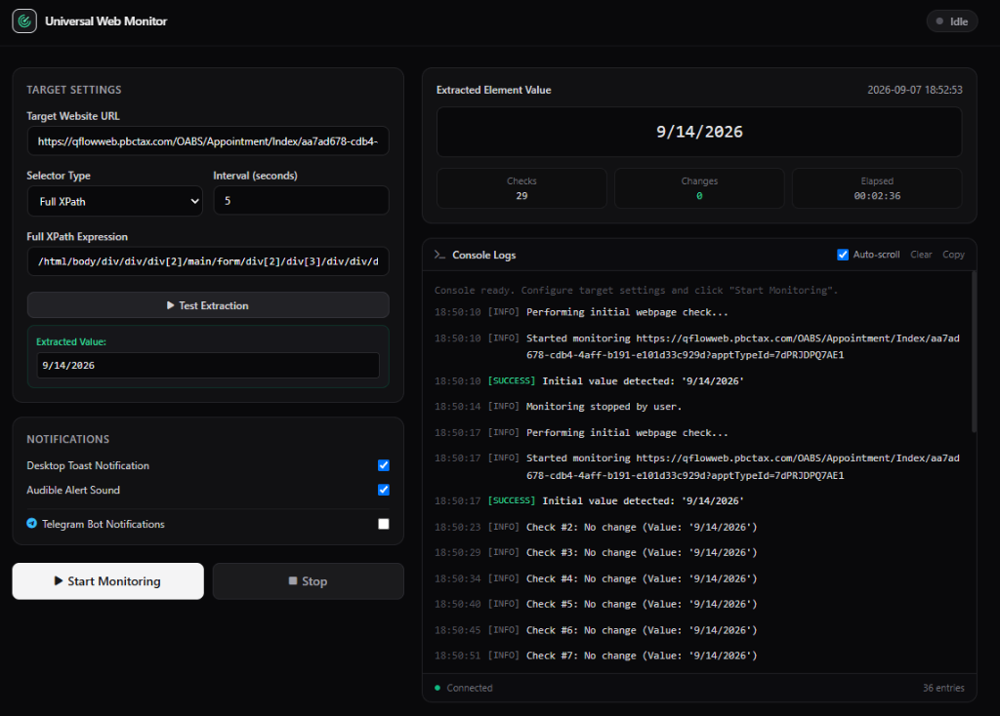
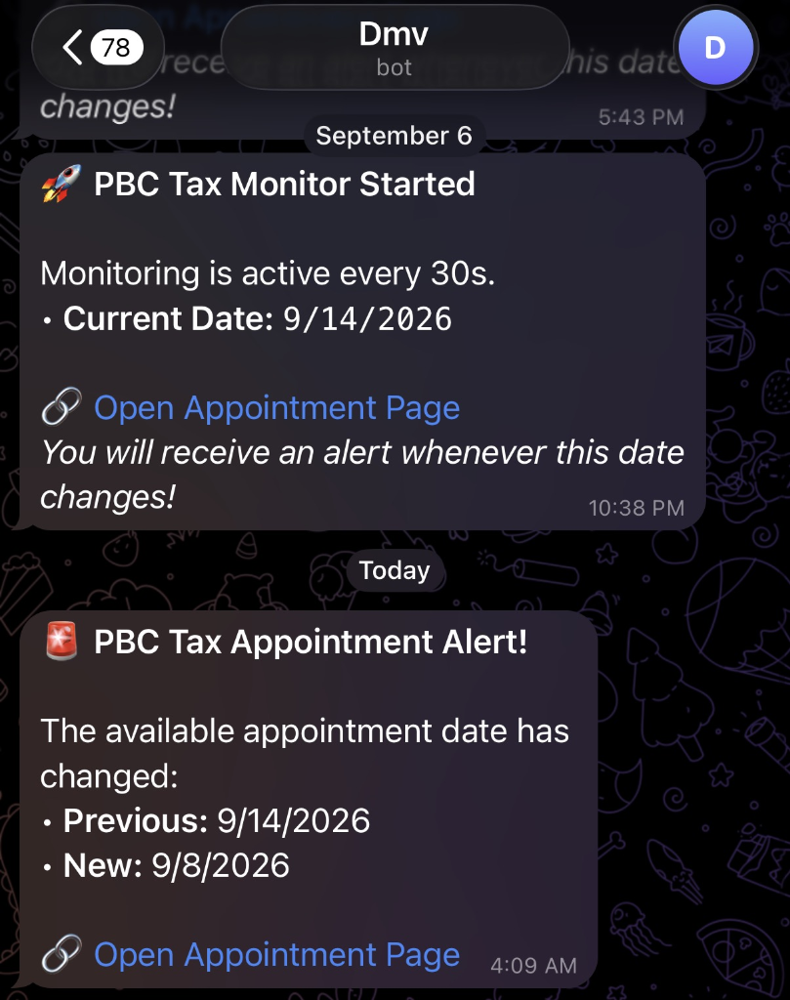

# Universal Webpage & Element Monitor

An automated web scraper and real-time element monitoring dashboard. Track specific element changes across any website and receive instant multi-channel alerts (Windows Desktop Toasts, audible chimes, and Telegram Bot notifications).

---



---

## ✨ Features

- **Flexible Multi-Selector Parsing**: Monitor elements using **XPath**, **Full XPath**, **CSS Selectors**, **Regex Match Groups**, or **Full Page Content**.
- **Instant "Test Extraction" Preview**: Verify what data is extracted from the target page on demand before starting the monitoring loop.
- **Real-Time Live Console**: Server-Sent Events (SSE) stream terminal logs with timestamps, check numbers, and status badges directly to your browser.
- **Multi-Channel Alert System**:
  - 🖥️ **Desktop Notifications**: Native Windows Toast banner notifications.
  - 🔊 **Sound Alerts**: Audible startup chimes and alert beeps upon change detection.
  - 📱 **Telegram Bot Integration**: High-priority push notifications delivered to your phone with direct website links.
- **Minimalist Dark UI**: Fast, responsive dashboard built with Tailwind CSS.
- **CLI & Web Interface**: Run as a browser-based web dashboard or headless via command line.

---

## 🚀 Quick Start

### 1. Prerequisites
- Python 3.10+
- `pip` (Python package manager)

### 2. Installation

Clone the repository and install the dependencies:

```bash
git clone https://github.com/arvinourian/universal-web-monitor.git
cd universal-web-monitor
pip install -r requirements.txt
```

### 3. Launch the Web Dashboard

```bash
python app.py
```

Open your browser and navigate to:
👉 **`http://localhost:5000`**

---

## 📖 How to Use the Web Application

### Step 1: Inspect and Get the Selector
1. Open your target website in Google Chrome, Firefox, or Edge.
2. Right-click on the element you want to track (e.g. price, appointment date, stock status, waiting list count) and select **Inspect**.
3. In the Elements panel:
   - **For XPath**: Right-click the highlighted HTML tag ➔ **Copy** ➔ **Copy XPath** (or **Copy Full XPath**).
   - **For CSS Selector**: Right-click ➔ **Copy** ➔ **Copy selector** (e.g., `#status-badge`, `.firstAvailableDate`).

### Step 2: Configure the Target
1. **Target Website URL**: Paste the URL of the page you want to monitor.
2. **Selector Type**: Choose `XPath`, `Full XPath`, `CSS Selector`, `Regex Group`, or `Full Page Content`.
3. **Interval**: Set how often (in seconds) the script should refresh the page (default: `30` seconds).
4. **Selector Expression**: Paste the copied XPath or CSS selector.

### Step 3: Test the Extraction
Click the **"Test Extraction"** button. The app will immediately fetch the webpage and display the extracted value in a green box. This ensures your selector works before starting continuous monitoring.

### Step 4: Start Monitoring
Click **"Start Monitoring"**. The dashboard will:
- Display the initial detected value.
- Begin polling at your chosen interval.
- Stream every check directly into the **Console Logs** terminal.
- Trigger desktop and Telegram alerts the moment the element text changes.

---

## 📱 Telegram Alerts Setup (The BotFather Method)

To receive push notifications straight to your mobile phone via Telegram:

```
┌──────────────┐       /newbot        ┌──────────────┐
│  You / Phone │ ───────────────────> │  @BotFather  │
│              │ <─────────────────── │              │
└──────────────┘      API Token       └──────────────┘
       │                                     │
       ▼                                     ▼
 1. Send /start to your bot          2. Paste Token in Web UI
                                             │
                                             ▼
                                     3. Click "Test Bot Connection"
```

### Step-by-Step Instructions:

1. **Open Telegram** on your phone or desktop and search for **`@BotFather`** (the official verified Telegram bot creation tool).
2. Start a chat with BotFather and send the command:
   ```text
   /newbot
   ```
3. Follow the prompts:
   - Enter a **name** for your bot (e.g., `My Website Monitor`).
   - Enter a unique **username** ending in `bot` (e.g., `my_custom_monitor_bot`).
4. BotFather will reply with your **HTTP API Token** (formatted like `123456789:ABCdefGhIJKlmNoPQRstuvwxYZ`).
5. **Start your new bot**:
   - Tap the link provided by BotFather (e.g., `t.me/my_custom_monitor_bot`).
   - Press the **Start** button (or send any message like `hi` or `/start`).
   > *Note: Telegram requires you to message your bot first so it has permission to send you notifications.*
6. **Connect to Web Monitor**:
   - In the Web Monitor dashboard, check **Telegram Bot Notifications**.
   - Paste your **Bot API Token** into the input field.
   - Click **"Test Bot Connection"**. You will immediately receive a test notification on your phone!

<p align="center">
  
</p>

---

## 💻 Standalone CLI Usage (Headless Mode)

If you prefer running the monitor directly from a terminal or remote server without the web interface:

```bash
# Basic monitoring
python monitor.py --url "https://example.com/page" --xpath "//div[@id='target']" --interval 30

# With Telegram notifications
python monitor.py \
  --url "https://example.com/page" \
  --xpath "//div[@id='target']" \
  --interval 30 \
  --bot-token "123456789:ABCdefGhIJKlmNoPQRstuvwxYZ"
```

### CLI Arguments:
| Flag | Description | Default |
|------|-------------|---------|
| `--url`, `-u` | Target website URL to monitor | Prompted |
| `--xpath`, `-x` | XPath query expression | Prompted |
| `--interval`, `-i` | Check interval in seconds | `30` |
| `--bot-token` | Telegram Bot API Token | Optional |
| `--chat-id` | Telegram Chat ID (auto-detected if omitted) | Optional |

---

## 📂 Project Structure

```text
universal-web-monitor/
├── app.py                 # Flask web server & REST/SSE API endpoints
├── monitor_engine.py      # Core scraping engine, selector parser & notifications
├── monitor.py             # Standalone CLI monitor
├── requirements.txt       # Python dependencies
├── .gitignore             # Git ignore patterns
├── docs/
│   └── screenshot.png     # Dashboard screenshot
├── static/
│   └── app.js             # Frontend controller & SSE event consumer
└── templates/
    └── index.html         # Minimalist dark-mode dashboard interface
```


